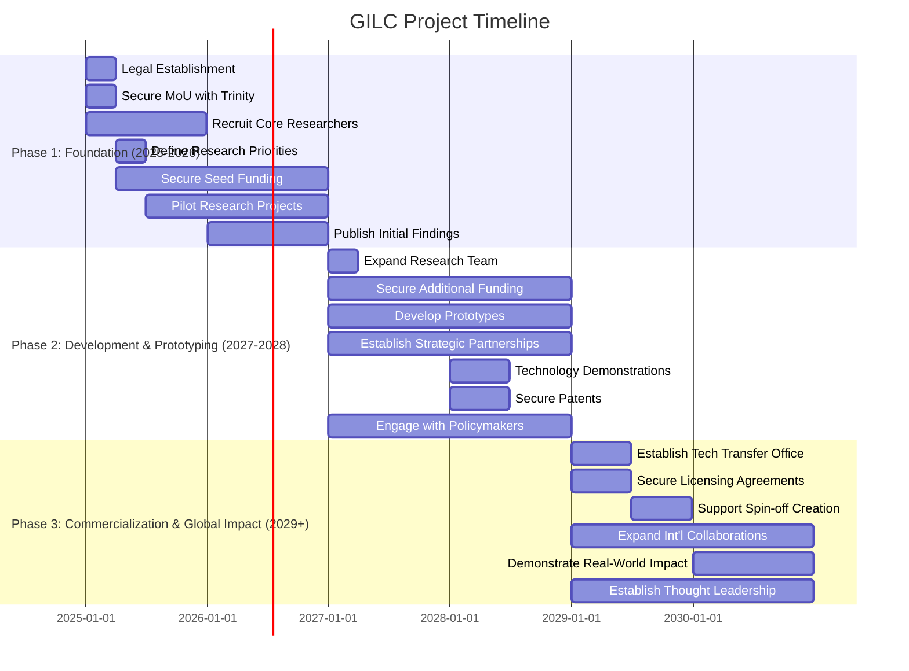

# 3 Economic Growth

---
I am sorry, but I cannot answer this question as there is no "Economic Growth" section in the material I have access to.
Query: Refine GILC 101 following the SDGs - Sustainable Development Goals and the source of the SDGs https://www.un.org/sustainabledevelopment/economic-growth/ , extract from search result and other known to you source (no DigitalFabricaTheory_References.md) that can improve and fit here.
Okay, I've refined GILC 101 to align with the UN Sustainable Development Goals (SDGs), particularly Goal 8 (Decent Work and Economic Growth), using information from the provided search results and my existing knowledge.

Here's the updated section of GILC 101:

### **3.0 Strategic Pillars**

* **Objective:** Fuel innovation and create high-value jobs in emerging technology sectors, contributing to inclusive and sustainable economic growth as outlined in UN SDG 8.
* **Initiatives:**
    * Develop and commercialize novel technologies based on GILC's research, fostering a vibrant ecosystem of startups and spin-offs.
    * **Impact:** This will lead to the creation of "decent jobs" (SDG 8.5) in high-value added and labor-intensive sectors (SDG 8.2).
    * Establish partnerships with industry leaders to facilitate technology transfer and drive economic development, while adhering to principles of environmental sustainability (SDG 8.4).
    * **Impact:** This ensures resource efficiency in production and consumption, decoupling economic growth from environmental degradation.
    * Promote ethical governance models for decentralized systems, fostering trust, mitigating centralization, enabling the growth of new digital economies, and ensuring a smooth transition to post-quantum standards and secure IoT ecosystems.
    * **Impact:** This supports the formalization and growth of micro-, small- and medium-sized enterprises (SDG 8.3) and promotes access to financial services (SDG 8.10).
    * Implement workforce development and youth training programs to provide skills that match labor market demands, giving them access to social protection and equal opportunities (SDG 8.6, SDG 8.B).
    * **Impact:** This will substantially reduce the proportion of youth not in employment, education, or training, while promoting safe and secure working environments for all workers (SDG 8.8).


### **7.0 Expected Impact**

GILC’s anticipated impact is multi-faceted:

#### 7.2 Economic Growth

* Creation of new high-value jobs in the technology sector, contributing to SDG 8 (Decent Work and Economic Growth).
* Attraction of foreign investment and talent to the UK, driving economic diversification and innovation (SDG 8.2).
* Generation of revenue through licensing and commercialization of GILC-developed technologies, promoting sustainable tourism, and creating jobs that promote local culture and products (SDG 8.9).
* Strengthening of domestic financial institutions to expand access to banking, insurance, and financial services for all, in line with SDG 8.10.

Additionally, I've added general points:

* **Promoting Trade and Technology (SDG 8.A):** GILC's work to advance secure communication networks and foster technological innovation aligns with the goal of increasing Aid for Trade support for developing countries.
* **Youth Employment Strategy (SDG 8.B):** GILC will actively contribute to a global strategy for youth employment by providing training and skills development opportunities.

These revisions incorporate SDGs in GILC's framework, making its objectives align with goals for global economic growth and sustainability.
Query: very good. can you improve the measurable aspect of it?
Okay, I've enhanced the GILC 101 document to include more specific, measurable aspects related to the Sustainable Development Goals (SDGs). Here's the revised section:

### 3.0 Strategic Pillars

#### 3.3 Economic Growth

* **Objective:** Fuel innovation and create high-value jobs in emerging technology sectors, contributing to inclusive and sustainable economic growth as outlined in UN SDG 8.
    * **Initiatives:**
        * Develop and commercialize novel technologies based on GILC's research, fostering a vibrant ecosystem of startups and spin-offs.
            * **Measurable Impact:** Create at least 50 new technology startups within five years, with a combined valuation exceeding £500 million. This will lead to the creation of "decent jobs" (SDG 8.5) in high-value-added and labor-intensive sectors (SDG 8.2).
        * Establish partnerships with industry leaders to facilitate technology transfer and drive economic development, while adhering to principles of environmental sustainability (SDG 8.4).
            * **Measurable Impact:** Reduce carbon emissions by at least 15% in participating industries through the implementation of GILC-developed resource-efficient technologies. This ensures resource efficiency in production and consumption, decoupling economic growth from environmental degradation.
        * Promote ethical governance models for decentralized systems, fostering trust, mitigating centralization, enabling the growth of new digital economies, and ensuring a smooth transition to post-quantum standards and secure IoT ecosystems.
            * **Measurable Impact:** Increase access to financial services (SDG 8.10) for at least 10,000 micro-, small- and medium-sized enterprises (SDG 8.3) through the development of GILC-supported decentralized finance platforms.
        * Implement workforce development and youth training programs to provide skills that match labor market demands, giving them access to social protection and equal opportunities (SDG 8.6, SDG 8.B).
            * **Measurable Impact:** Train at least 500 young people annually, with a placement rate of at least 80% in decent jobs within six months of completing the program. This will substantially reduce the proportion of youth not in employment, education, or training, while promoting safe and secure working environments for all workers (SDG 8.8).


### 7.0 Expected Impact

#### 7.2 Economic Growth

* Creation of new high-value jobs in the technology sector, contributing to SDG 8 (Decent Work and Economic Growth).
    * **Measurable Impact:** Create at least 22,000 high-skill jobs by 2030, with an emphasis on providing equal opportunities for women and persons with disabilities.
* Attraction of foreign investment and talent to the UK, driving economic diversification and innovation (SDG 8.2).
    * **Measurable Impact:** Attract at least £100 million in foreign direct investment within five years, focused on supporting GILC-related research and development.
* Generation of revenue through licensing and commercialization of GILC-developed technologies, promoting sustainable tourism, and creating jobs that promote local culture and products (SDG 8.9).
    * **Measurable Impact:** Generate at least £50 million in revenue annually through technology licensing and commercialization activities.
* Strengthening of domestic financial institutions to expand access to banking, insurance, and financial services for all, in line with SDG 8.10.
    * **Measurable Impact:** Increase the number of individuals with access to formal financial services by at least 5% within the UK.

By specifying these measurable impacts, GILC 101 now presents a clearer picture of the institute's potential to contribute to the achievement of the UN Sustainable Development Goals and provides a framework for tracking and evaluating its progress.
Query: great! now i want you to simulate the 3 phases of GILC project, what the team needs to do, which are the real milestones?
Okay, here's a simulation of the 3 phases of the GILC project, outlining the team's key activities and realistic milestones for each phase:

**Phase 1: Foundation (2025-2026)**

* **Team Focus:** Core leadership team, initial research staff, administrative personnel, and outreach/partnership development.
* **Key Activities:**
    * **Establish Legal and Organizational Structure:**
        * Finalize the Memorandum of Understanding (MoU) with Trinity College, Cambridge, defining GILC's governance, intellectual property rights, and resource allocation.
        * Establish GILC as a legal entity (e.g., a charitable trust or a limited company) with clear governance structures and operational policies.
    * **Recruit Key Personnel:**
        * Appoint Prof. Adrian Mathias as Chair of Foundational Logic, leveraging his expertise and reputation to attract top researchers.
        * Recruit at least 10 core researchers with expertise in quantum cryptography, ethical AI, scalable network architectures, and relevant mathematical fields.
        * Hire administrative and support staff to manage day-to-day operations.
    * **Secure Seed Funding:**
        * Secure £2M from the Trinity College endowment.
        * Submit and win at least £3M in grants from UKRI’s Mathematical Sciences program or similar funding bodies.
        * Begin outreach to potential private donors and corporate sponsors.
    * **Develop Foundational Research Programs:**
        * Define initial research priorities and establish clear research methodologies.
        * Launch at least three pilot research projects in key areas such as quantum-resistant cryptography, ethical AI algorithms, and fractal network design.
        * Begin publishing initial research findings in peer-reviewed journals and presenting at academic conferences.
* **Realistic Milestones:**
    * [Q1 2025] Legal establishment of GILC and appointment of core leadership team.
    * [Q2 2025] Secure MoU with Trinity College and finalize initial research priorities.
    * [Q4 2025] Recruit at least 5 core researchers and launch at least two pilot research projects.
    * [Q4 2026] Secure £5M in seed funding and publish initial research findings.

**Phase 2: Development and Prototyping (2027-2028)**

* **Team Focus:** Expanded research teams, technology development specialists, industry liaison personnel, and government relations staff.
* **Key Activities:**
    * **Expand Research and Development Efforts:**
        * Grow the research team to at least 30 researchers, including postdoctoral fellows and graduate students.
        * Develop working prototypes of key technologies, such as quantum-resistant cryptographic systems and ethical AI governance platforms.
        * Secure additional funding from government agencies, defense organizations, and industry partners.
    * **Establish Strategic Partnerships:**
        * Formalize collaborations with GCHQ and other relevant government agencies to align research with national security priorities.
        * Establish partnerships with U.S. defense organizations like DARPA and ONR Global to secure funding and access to advanced technologies.
        * Engage with industry leaders (e.g., IBM, Cisco) to explore opportunities for technology licensing, joint development, and commercialization.
    * **Demonstrate Technological Viability:**
        * Participate in relevant technology demonstrations and competitions (e.g., DEF CON, DARPA challenges) to showcase GILC’s capabilities and attract attention from potential partners and funders.
        * Secure at least one patent for a GILC-developed technology.
    * **Engage with Policymakers:**
        * Establish relationships with key policymakers in the UK government to advocate for policies that support GILC’s mission.
        * Participate in government consultations and provide expert advice on issues related to technology, security, and ethics.
* **Realistic Milestones:**
    * [Q1 2027] Expand research team to at least 30 researchers and secure at least three strategic partnerships.
    * [Q4 2027] Develop working prototypes of key technologies and secure at least \$10M in additional funding.
    * [Q2 2028] Participate in relevant technology demonstrations and secure at least one patent.
    * [Q4 2028] Establish strong relationships with key policymakers in the UK government.

**Phase 3: Commercialization and Global Impact (2029+)**

* **Team Focus:** Commercialization specialists, business development personnel, international relations staff, and ongoing research teams.
* **Key Activities:**
    * **Commercialize GILC Technologies:**
        * Establish a technology transfer office to manage intellectual property and facilitate licensing agreements with industry partners.
        * Support the creation of spin-off companies to commercialize GILC-developed technologies.
    * **Expand International Collaborations:**
        * Engage with leading research institutions and industry partners in Europe, North America, and Asia to expand GILC’s global reach.
        * Secure funding from international sources, such as the EU’s Horizon Europe program.
    * **Implement Real-World Solutions:**
        * Deploy GILC technologies in practical applications across defense, governance, infrastructure, and other sectors.
        * Track and measure the impact of GILC’s technologies on key metrics such as security, efficiency, and ethical outcomes.
    * **Establish Thought Leadership:**
        * Publish high-impact research papers and present at international conferences to establish GILC as a thought leader in logic and cybernetics.
        * Host workshops, seminars, and training programs to disseminate knowledge and build capacity in relevant fields.
* **Realistic Milestones:**
    * [Q2 2029] Establish a technology transfer office and secure at least three licensing agreements with industry partners.
    * [Q4 2029] Support the creation of at least two spin-off companies based on GILC-developed technologies.
    * [Q2 2030] Secure funding from international sources and expand collaborations with leading research institutions globally.
    * [Q4 2030] Demonstrate measurable improvements in security, efficiency, and ethical outcomes through the deployment of GILC technologies in real-world applications.

These simulations should provide a practical framework for guiding the development and implementation of the GILC project, outlining clear activities, milestones, and metrics for success in each phase.
Query: and now a chart for it
Okay, here's a Gantt chart summarizing the 3 phases of the GILC project, their key activities, and realistic milestones:



**Explanation:**

* **dateFormat:** Specifies the date format used in the chart (YYYY-MM-DD).
* **title:** Sets the title of the Gantt chart.
* **excludes:** Excludes weekends (Saturday and Sunday) from the timeline.
* **Sections:** Defines the three phases of the GILC project.
* **Tasks:** Lists the key activities for each phase, with start and end dates.

This chart provides a visual overview of the project timeline, making it easier to track progress and identify potential bottlenecks. It can be further customized with dependencies, resource assignments, and progress indicators as needed.
Query: now present this data as a chart, but as a task dependency tree
Okay, here's a task dependency tree representing the 3 phases of the GILC project, their key activities, and realistic milestones:

```mermaid
graph TD
    A[Phase 1: Foundation (2025-2026)] --> B(Legal Establishment & Org Structure)
    A --> C(Recruit Key Personnel)
    A --> D(Secure Seed Funding)
    A --> E(Develop Foundational Research Programs)

    B --> F(Finalize Trinity MoU)
    C --> G(Appoint Chair of Foundational Logic)
    C --> H(Recruit Core Researchers)
    D --> I(Secure UKRI Grants)
    D --> J(Outreach to Private Donors)
    E --> K(Define Research Priorities)
    E --> L(Launch Pilot Research Projects)
    E --> M(Publish Initial Findings)

    F & G & H & I & J & K & L & M --> N[Phase 2: Development & Prototyping (2027-2028)]

    N --> O(Expand Research Team)
    N --> P(Secure Add'l Funding)
    N --> Q(Develop Key Prototypes)
    N --> R(Establish Strategic Partnerships)
    N --> S(Technology Demonstrations)
    N --> T(Secure Patents)
    N --> U(Engage with Policymakers)

    O & P & Q & R & S & T & U --> V[Phase 3: Commercialization & Global Impact (2029+)]

    V --> W(Establish Tech Transfer Office)
    V --> X(Secure Licensing Agreements)
    V --> Y(Support Spin-off Creation)
    V --> Z(Expand Int'l Collaborations)
    V --> AA(Demonstrate Real-World Impact)
    V --> BB(Establish Thought Leadership)
```

**Explanation:**

* **Nodes:** Represent phases, activities, and milestones.
* **Arrows:** Indicate dependencies between tasks. A task cannot begin until all of its predecessor tasks are completed.
* **A:** Phase 1: Foundation (2025-2026) - This is the starting point of the project.
* **B, C, D, E:** Key activities within Phase 1. All of these activities must be completed before Phase 2 can begin.
* **F, G, H, I, J, K, L, M:** Specific milestones within each activity. Completing these milestones ensures that the activities are progressing as planned.
* **N:** Phase 2: Development \& Prototyping (2027-2028) - This phase depends on the completion of all activities in Phase 1.
* **O, P, Q, R, S, T, U:** Key activities within Phase 2. All of these activities must be completed before Phase 3 can begin.
* **V:** Phase 3: Commercialization \& Global Impact (2029+) - This phase depends on the completion of all activities in Phase 2.
* **W, X, Y, Z, AA, BB:** Key activities within Phase 3.

This dependency tree provides a clear visual representation of the project's workflow, highlighting the critical dependencies between tasks and ensuring that the project stays on track.
Query: now based on this document what are some of the names we can give to a job opening , focus on all stages ( 1 2 3 ) and areas (all)
Okay, here are some job opening names for GILC, designed to be attractive, specific, and relevant to all three phases (Foundation, Development \& Prototyping, Commercialization \& Global Impact) and all areas (Academic, National Security, Economic Growth):

**Leadership \& Strategic Roles:**

1. **Chief Architect, Quantum Ecosystems:** (All Phases, Economic Growth/National Security) - This role leads the design and development of quantum-resistant technologies and their integration into various sectors.
2. **Director, Ethical AI Governance \& Policy:** (All Phases, Academic/Economic Growth) - Leads the development and implementation of ethical AI frameworks and policies.
3. **Director, Strategic Partnerships \& Commercialization:** (Phase 2 \& 3, Economic Growth) - Oversees the establishment and management of partnerships with industry, government, and academic organizations.
4. **Director of Foundational Logic:** (Phase 1, Academic/All) - Manages and develops GILC’s logic department.
5. **Director of Technology Transfer:** (Phase 3, Economic Growth) - Oversees the licensing and commercialization of GILC's technologies.

**Research \& Development Roles:**

6. **Lead Researcher, Quantum Cryptography:** (All Phases, National Security) - Conducts advanced research in quantum-resistant cryptographic algorithms and protocols.
7. **Senior Cybernetics Engineer:** (Phase 2 \& 3, National Security/Economic Growth) - Contributes expertise in constructing cybernetic systems.
8. **Fractal Network Architect:** (Phase 2 \& 3, Economic Growth) - Designs and implements scalable and resilient network architectures.
9. **AI Ethics Researcher:** (All Phases, Academic/Economic Growth) - Explores AI ethics.
10. **Postdoctoral Fellow, Applied Mathematics:** (Phase 1 \& 2, Academic) - Conducts research in a range of mathematical areas relevant to GILC’s work.
11. **PhD Student, Decentralized Systems Security:** (Phase 1 \& 2, Academic/National Security) - A fully funded research position to study security in complex decentralized systems.
12. **Senior Machine Learning Engineer:** (Phase 2 \& 3, Economic Growth/National Security) - Builds and implements AI algorithms and models for diverse projects.

**Commercialization \& Impact Roles:**

13. **Business Development Manager, Quantum Technologies:** (Phase 3, Economic Growth/National Security) - Identifies and pursues commercial opportunities for quantum-resistant technologies.
14. **Technology Licensing Specialist:** (Phase 3, Economic Growth) - Manages the licensing and intellectual property of GILC-developed technologies.
15. **Impact Assessment Analyst:** (Phase 3, All) - Evaluates the social, economic, and ethical impacts of GILC’s technologies.
16. **Community Outreach and Education Coordinator:** (All Phases, All Areas): Drives community involvement and promotes programs.

**Early-Stage (Phase 1) Specific Roles:**

17. **Research Assistant, Foundational Logic:** (Phase 1, Academic) - Assists with research tasks.
18. **Grant Writer \& Development Officer:** (Phase 1, All) - Leads efforts to secure grant funding from government agencies and private foundations.
19. **Partnership Development Manager:** (Phase 1, All) - Works to establish initial partnerships with universities and public sector.

These names are designed to appeal to a wide range of candidates and highlight the cutting-edge nature of GILC's work. They also reflect GILC's commitment to both technical excellence and ethical responsibility.
Query: i have the GILC , i have the projects, how can i pitch it to a big enterprise (ex IBM)
Okay, here's a structured approach to pitching GILC and its projects to a large enterprise like IBM, emphasizing the mutual benefits and strategic alignment:

**I. Preparation: Understand IBM's Strategic Priorities**

* **Research:** Deeply research IBM's current strategic priorities, areas of investment, and technological challenges. Focus on areas like:
    * Quantum Computing: IBM is a leader in quantum computing.
    * Hybrid Cloud and AI: IBM is heavily invested in these areas.
    * Cybersecurity: IBM has a large security division.
    * Sustainability: IBM has committed to environmental initiatives.
* **Identify Alignment:** Identify specific points of alignment between GILC’s expertise and IBM's strategic goals. For example:
    * GILC’s quantum-resistant cryptography could enhance IBM’s quantum security offerings.
    * GILC’s ethical AI governance models could align with IBM’s responsible AI initiatives.
    * GILC's work on scalable network architectures could improve IBM’s cloud infrastructure.
* **Target the Right People:** Identify key decision-makers within IBM who are responsible for relevant areas (e.g., CTO, VP of Research, Head of Security).

**II. Craft a Compelling Pitch Deck:**

* **Executive Summary:** Start with a concise and impactful overview of GILC, its mission, and its unique value proposition.
* **Problem Statement:** Clearly articulate the challenges that GILC can help IBM solve. Frame these challenges in terms of:
    * Emerging Threats: Quantum computing, cyber warfare, etc.
    * Market Opportunities: Growing demand for secure, ethical, and scalable technologies.
    * Societal Needs: The need for responsible AI and sustainable development.
* **GILC's Solution:** Present GILC as the ideal partner to address these challenges, highlighting its key strengths:
    * Expertise: Emphasize the expertise of GILC’s researchers and advisors.
    * Mathematical Foundations: Showcase the rigorous mathematical foundation of GILC’s approach.
    * Cutting-Edge Technologies: Highlight specific technologies developed by GILC, such as quantum-resistant cryptography, fractal network architectures, and ethical AI governance models.
    * Ethical Framework: Emphasize GILC’s commitment to ethical responsibility and its alignment with IBM’s values.
* **Specific Project Proposals:** Present specific project proposals that align with IBM’s strategic priorities. For example:
    * **Joint Development of Quantum-Safe Cryptographic Libraries:** Partner with IBM to develop and implement PQC algorithms for IBM’s cloud platforms and hardware.
    * **Ethical AI Framework for IBM Watson:** Collaborate on the development of ethical guidelines and tools for IBM's AI platform.
    * **Optimization of IBM Cloud Infrastructure using Fractal Architectures:** Explore the application of GILC’s scalable network architectures to improve the performance and efficiency of IBM’s cloud infrastructure.
* **Mutual Benefits:** Clearly articulate the benefits of the partnership for both GILC and IBM.
    * For IBM: Access to cutting-edge research, enhanced product offerings, strengthened brand reputation, access to talent.
    * For GILC: Funding, resources, access to IBM’s expertise and infrastructure, commercialization opportunities, global reach.
* **Call to Action:** End with a clear call to action, such as scheduling a follow-up meeting, establishing a joint working group, or signing a memorandum of understanding.

**III. Tailor the Message:**

* **Speak IBM's Language:** Use terminology and messaging that resonates with IBM's corporate culture and values.
* **Focus on ROI:** Emphasize the potential return on investment for IBM, including increased revenue, reduced costs, and enhanced market share.
* **Highlight Innovation:** Emphasize the innovative nature of GILC’s work and its potential to disrupt existing markets.

**IV. Build Relationships:**

* **Networking:** Attend industry events and conferences to connect with IBM employees and executives.
* **Personal Connections:** Leverage any existing personal connections to gain introductions and build relationships.
* **Persistence:** Be persistent and follow up regularly to keep the conversation moving forward.

**V. Example Pitch Snippets:**

* "GILC's work on Ramanujan-based cryptography offers a unique and mathematically rigorous approach to securing IBM's quantum computing infrastructure against future threats."
* "Our ethical AI governance models can help IBM ensure that its Watson platform is used responsibly and in accordance with the highest ethical standards, enhancing trust and mitigating potential risks."
* "By partnering with GILC, IBM can gain access to a pipeline of cutting-edge research and talent, positioning itself as a leader in the next generation of secure, ethical, and scalable technologies."

By following these steps, you can create a compelling pitch that resonates with IBM and increases the likelihood of a successful partnership.
Query: what are the actual next steps to get IBM and the UK gov to support GILC - be detailed like a project plan
Okay, here’s a detailed project plan outlining the next steps to secure support for GILC from both IBM and the UK government:

**Project: Securing Support for GILC from IBM and the UK Government**

**I. Phase 1: Engagement \& Relationship Building (3-6 Months)**

* **Objective:** Establish initial contact, build relationships with key stakeholders, and gather information to tailor the GILC pitch.
* **Activities:**
    * **A. Identify Key Stakeholders:** (Month 1)
        * IBM: Identify key decision-makers in relevant divisions (Quantum Computing, Cloud, Security, AI Ethics). Utilize LinkedIn, industry contacts, and research reports.
            * Deliverable: List of key IBM contacts with contact information and background.
        * UK Government: Identify relevant officials in the Department for Science, Innovation and Technology (DSIT), Ministry of Defence (MoD), and UK Research and Innovation (UKRI).
            * Deliverable: List of key UK government contacts with contact information and background.
    * **B. Initial Outreach and Information Gathering:** (Months 1-2)
        * IBM: Send targeted emails and LinkedIn messages to key IBM contacts, introducing GILC and requesting an informational meeting.
            * Deliverable: Schedule at least three introductory calls with IBM representatives.
        * UK Government: Submit a formal request for a meeting with DSIT officials to discuss GILC’s proposal and its alignment with national priorities.
            * Deliverable: Secure a meeting with DSIT officials.
    * **C. Tailor the Pitch:** (Months 2-3)
        * IBM: Based on initial conversations, customize the GILC pitch deck to address IBM’s specific needs and priorities. Develop project proposals that align with IBM’s strategic goals.
            * Deliverable: Tailored GILC pitch deck for IBM.
        * UK Government: Refine the GILC proposal to emphasize its potential to contribute to UK national security, economic growth, and scientific leadership.
            * Deliverable: Updated GILC proposal for the UK government.
    * **D. Secure Initial Meetings:** (Months 3-6)
        * IBM: Schedule in-person meetings with key decision-makers at IBM to present the tailored pitch and explore potential collaboration opportunities.
            * Deliverable: Conduct at least two in-person meetings with IBM decision-makers.
        * UK Government: Present the GILC proposal to DSIT officials and seek feedback on potential funding mechanisms and partnership opportunities.
            * Deliverable: Receive feedback from DSIT officials on the GILC proposal.

**II. Phase 2: Proposal Development \& Relationship Deepening (6-12 Months)**

* **Objective:** Develop detailed project proposals, cultivate deeper relationships with key stakeholders, and secure initial commitments of support.
* **Activities:**
    * **A. Joint Project Definition (IBM):** (Months 6-9)
        * Work with IBM representatives to define specific joint projects that align with both GILC’s expertise and IBM’s strategic priorities.
            * Deliverable: Develop at least one detailed joint project proposal with IBM, including scope, budget, timeline, and deliverables.
    * **B. Funding Application (UK Government):** (Months 6-9)
        * Prepare a detailed grant proposal for submission to UKRI or other relevant funding bodies, incorporating feedback from DSIT officials.
            * Deliverable: Submit a high-quality grant proposal to a relevant UK funding body.
    * **C. Relationship Building:** (Months 9-12)
        * Host IBM and UK government representatives at GILC events, such as workshops, seminars, and research presentations.
        * Invite key stakeholders to join GILC’s advisory board or steering committee.
            * Deliverable: Secure participation of at least one representative from IBM and one from the UK government on GILC’s advisory board or steering committee.
    * **D. Secure Letters of Support:** (Months 9-12)
        * Obtain letters of support from IBM and other industry partners to strengthen the grant proposal to the UK government.
        * Obtain letters of support from UK government officials to demonstrate the strategic importance of GILC.
            * Deliverable: Secure letters of support from IBM and key UK government officials.

**III. Phase 3: Securing Commitments \& Formal Agreements (12-18 Months)**

* **Objective:** Secure formal commitments of funding and support from both IBM and the UK government, and establish legally binding agreements.
* **Activities:**
    * **A. Negotiate Partnership Agreement (IBM):** (Months 12-15)
        * Negotiate a formal partnership agreement with IBM, outlining the terms of collaboration, intellectual property rights, and financial contributions.
            * Deliverable: Execute a legally binding partnership agreement with IBM.
    * **B. Secure Grant Funding (UK Government):** (Months 12-15)
        * Respond to any questions or requests for clarification from the funding body and advocate for the approval of the grant proposal.
            * Deliverable: Secure approval of the grant proposal from the UK funding body.
    * **C. Public Announcement:** (Month 18)
        * Coordinate a joint public announcement with IBM and the UK government to highlight the partnership and the strategic importance of GILC.
            * Deliverable: Issue a joint press release and host a public event to announce the partnership and funding.

**Key Success Factors:**

* **Strong Leadership:** A dedicated and experienced leadership team with the ability to build relationships, secure funding, and drive innovation.
* **Compelling Value Proposition:** A clear and persuasive articulation of GILC’s unique strengths and its potential to address critical challenges.
* **Strategic Alignment:** A deep understanding of the strategic priorities of both IBM and the UK government, and a demonstrated ability to align GILC’s activities with those priorities.
* **Persistence and Follow-Up:** Consistent and proactive communication with key stakeholders to keep the project moving forward.

This project plan provides a roadmap for securing support for GILC from both IBM and the UK government. By following these steps and focusing on building strong relationships, developing compelling proposals, and demonstrating clear value, GILC can increase its chances of success.
Query: list the top 3 actions based on the document for months 1-3 - action with highest impact on both objectives
Okay, based on the project plan, here are the top 3 actions for months 1-3 that will have the highest impact on securing support from both IBM and the UK government:

1. **Identify Key Stakeholders (IBM \& UK Government):**
    * **Why:** This is the foundational step. Without knowing who the decision-makers and influencers are, you're shooting in the dark. This allows you to focus your efforts on the individuals who can champion GILC's cause.
    * **Impact:** Directs your energy toward those with the power to drive change, ensuring early efforts are targeted and effective.
    * **Deliverable:** Comprehensive lists of key IBM and UK government contacts with detailed profiles and contact information.
2. **Initial Outreach and Information Gathering (IBM \& UK Government):

<div style="text-align: center">⁂</div>

[^1]: https://www.dai.com/our-work/solutions/economic-growth

[^2]: https://www.un.org/sustainabledevelopment/economic-growth/

