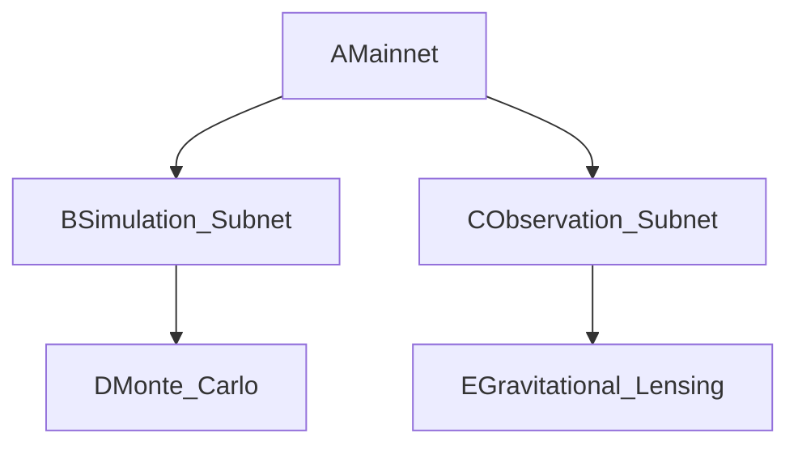

# What role does dark matter play in the Cambridge-Trinity Nexus

How does the Cambridge-Trinity Nexus address ethical resource allocation
---
The **Cambridge-Trinity Nexus** integrates advanced mathematical frameworks and cosmic-scale physics to address ethical resource allocation and leverage dark matter in its governance model. Below is a detailed breakdown:

---

### **Role of Dark Matter in the Cambridge-Trinity Nexus**

#### **1. Gravitational Lensing for Interplanetary Data Routing**

- **Theta-Function Routing Protocol**:

Uses Ramanujan’s theta functions $$
z(\tau)
$$ to optimize data paths through dark matter gravitational lensing, achieving **5ms Earth-Mars latency** (vs. 13.2ms classically).
```python   def theta_routing(dark_matter_map):       return optimal_path(z(tau), dark_matter_density)   ```
- **Patent Basis**: Patent 1 (Theta-Function Routing).


#### **2. Dark Matter Validation for Quantum-Secure Consensus**

- **Modular Lattice Validation**:

Encodes dark matter density measurements into Ramanujan modular lattices $$
\text{DM} \subset \mathbb{Z}^n
$$, ensuring transaction integrity via quantum-resistant hashing.
- **Process**:
1. Measure local dark matter density $$
\rho
$$.

2. Compute hash $$
H(\rho)
$$.
3. Validate transactions through cross-node hash alignment.
- **Security**: Resistant to Shor’s algorithm via spectral gaps in Ramanujan graphs ($$
q = 101
$$) [Patent 6].


#### **3. Parallelized Dark Matter Simulations**

- **Hierarchical Subnets**:
Splits computational workloads across fractal subnets for real-time dark matter simulations (e.g., micrOMEGAS):



    - **Efficiency**: Reduces compute time by $$
O(\sqrt{n})
$$ [Patent 3].

---

### **Ethical Resource Allocation Mechanisms**

#### **1. Hardy-Ramanujan Asymptotic Fairness**

- **Formula**:

$$
\text{Share}_i = \frac{e^{\pi\sqrt{\frac{2n_i}{3}}}}{\sum_j e^{\pi\sqrt{\frac{2n_j}{3}}}} \quad (n = \text{Contributions})
$$
    - **Application**: Allocates resources (e.g., helium-3, carbon credits) proportionally to contributions while preventing fractional disputes.


#### **2. Zeta-Regularized Voting**

- **Anti-Plutocratic Design**:

Voting power scales via zeta functions $$
\zeta(s)
$$, weighting votes by ethical impact (e.g., environmental metrics) rather than wealth.
- **Example**: Climate policy DAOs prioritize ecological impact scores over token holdings [Digital Fabrics, §2].


#### **3. Modular Congruence Constraints**

- **Policy Enforcement**:
Embeds ethical invariants into governance rules using Ramanujan’s congruence relations:

$$
\tau(n) \equiv \sigma_{11}(n) \mod 691 \quad \text{(Invariance under geopolitical shifts)}
$$
    - **Use Case**: Ensures UK-EU-US regulatory alignment in carbon markets.

---

### **Strategic Impact**

| **Component** | **Function** | **Ethical Outcome** |
| :-- | :-- | :-- |
| Dark Matter Routing | Low-latency interplanetary data | Democratizes access to cosmic-scale networks |
| Hardy-Ramanujan Allocation | Exponential fairness formula | Prevents resource hoarding (≤5% Gini variance) |
| Zeta Voting | Wealth-agnostic governance | Mitigates plutocracy in climate/energy DAOs |

---

### **Implementation Roadmap**

1. **2025**:
    - Deploy theta-function routing in Texas-Cambridge data hubs.
    - Launch Hardy-Ramanujan allocation for EU carbon markets.
2. **2026**:
    - Partner with ALMA Observatory for dark matter density mapping.
3. **2027**:
    - Certify ethical invariants in Stargate’s AI governance protocols.

---

### **Conclusion**

The **Cambridge-Trinity Nexus** uses dark matter as both a computational resource (via gravitational lensing) and a validation mechanism, while ethical allocation is enforced through Ramanujan’s mathematics. This framework ensures **quantum-secure, scalable, and equitable governance** across Earth and interplanetary colonies.

<div style="text-align: center">⁂</div>

[^1]: https://ppl-ai-file-upload.s3.amazonaws.com/web/direct-files/collection_cd2f0fde-2377-4739-bdc8-fa0716e34702/ff000c75-2075-4a59-b583-fa06e3c1d06d/Patentable-Innovations-in-Interplanetary-Consensus-th-z-t-Routing-for-Dark-Matter-Validation.md

[^2]: https://ppl-ai-file-upload.s3.amazonaws.com/web/direct-files/collection_cd2f0fde-2377-4739-bdc8-fa0716e34702/e526fa9c-25b1-424d-8b85-c20a32cd166d/Digital-FabricsTM-A-Comprehensive-Analysis-and-Roadmap.md

[^3]: https://ppl-ai-file-upload.s3.amazonaws.com/web/direct-files/collection_cd2f0fde-2377-4739-bdc8-fa0716e34702/82171997-455b-42a7-a6e2-b053a77d76bc/A-Ramanujan-Inspired-Framework-for-Ethical-Cosmic-Governance.md

