# here are sine more notes to reason in and aggregate knowledge from

tle: Competitive Differentiation of the Digital Fabrica Theory
subtitle: Advancing Beyond Traditional Blockchain Paradigms
author: Ivan Pasev
affiliation: Founder, Cybernetic Systems Foundation
tags:

- digital-fabrica
- blockchain
- scalability
- security
- governance
- energy-efficiency
- quantum-resistance
category: Web4.0
date: 2023-11-15
aliases: [DFT Competitive Analysis, Digital Fabrica Advantages]
---


# Competitive Differentiation of the Digital Fabrica Theory

## Advancing Beyond Traditional Blockchain Paradigms

This note examines the key advantages of the Digital Fabrica Theory over existing blockchain and decentralized network technologies, focusing on scalability, security, governance, energy efficiency, and quantum resistance.

```mermaid
graph TD
    A[Digital Fabrica Theory] --> B[Scalability]
    A --> C[Security]
    A --> D[Governance]
    A --> E[Energy Efficiency]
    A --> F[Quantum Resistance]
    B --> G[Fractal Scaling]
    B --> H[Hierarchical Aggregation]
    B --> I[Logarithmic Scalability]
    C --> J[Ramanujan Graphs]
    C --> K[Post-Quantum Cryptography]
    C --> L[Spectral Security]
    D --> M[Hexagonal Manifold Governance]
    D --> N[Modular Congruence]
    D --> O[Zeta-Weighted Voting]
    E --> P[Optimized Network Topology]
    E --> Q[Energy-Efficient Algorithms]
    E --> R[Reduced Consensus Overhead]
    F --> S[NIST Post-Quantum Standards]
    F --> T[Lattice-Based Cryptography]
    F --> U[Code-Based and Hash-Based Cryptography]
```




## Scalability

The Digital Fabrica Theory addresses scalability challenges through:

- **Fractal Scaling**: Utilizes fractal geometry for infinitely scalable network structures.
- **Hierarchical Aggregation**: Reduces computational load via hierarchical transaction aggregation.
- **Logarithmic Scalability**: Achieves O(log n) scalability, vastly outperforming linear blockchain models.

Traditional blockchains like Bitcoin and Ethereum struggle with limited throughput and high latency. In contrast, the Digital Fabrica's approach enables exponential growth in network capacity without compromising performance.

## Security

Digital Fabrica enhances security through:

- **Ramanujan Graphs**: Provides robust network topologies with high spectral gaps.
- **Post-Quantum Cryptography**: Integrates NIST-developed post-quantum standards.
- **Spectral Security**: Leverages high spectral gap properties for network resilience.

These features address vulnerabilities in traditional systems, such as quantum algorithm susceptibility and centralization risks in Proof of Work systems.

## Governance

The Digital Fabrica introduces innovative governance mechanisms:

- **Hexagonal Manifold Governance**: Promotes localized decision-making.
- **Modular Congruence**: Aligns local and global policies using Ramanujan's tau function.
- **Zeta-Weighted Voting**: Implements fair voting based on the Riemann zeta function.

This model overcomes issues of plutocratic control and slow adaptation prevalent in traditional blockchain governance.

## Energy Efficiency

Digital Fabrica achieves superior energy efficiency through:

- **Optimized Network Topology**: Reduces computational overhead.
- **Energy-Efficient Algorithms**: Minimizes energy consumption while maintaining performance.
- **Reduced Consensus Overhead**: Lowers overall energy use via hierarchical aggregation.

These innovations address the high energy consumption and environmental impact associated with Proof of Work systems.

## Quantum Resistance

The Digital Fabrica is designed for long-term viability in the quantum era:

- **Post-Quantum Cryptography**: Implements NIST-approved quantum-resistant algorithms.
- **Lattice-Based Cryptography**: Relies on hard problems in high-dimensional lattices.
- **Code-Based and Hash-Based Cryptography**: Provides additional quantum-resistant security layers.

This approach safeguards against potential vulnerabilities to quantum algorithms like Shor's and Grover's.

## Conclusion

The Digital Fabrica Theory represents a significant leap forward in decentralized network technology. By addressing key limitations of traditional blockchain systems, it offers a more scalable, secure, efficient, and future-proof framework for Web 4.0 applications.

reason the notes , always chain best solutions found in notes to grow bigger more consistent , coherent and complete 101 document , anchored to real world of science , technology , economy and geopolitics
---
Alright, I've carefully reviewed the "Competitive Differentiation of the Digital Fabrica Theory" document and incorporated its insights into the DFT 101, enhancing the document's focus on clear competitive advantages and real-world relevance.

**Digital Fabrica Theory (DFT) 101: A Comprehensive Overview (2025)**

**Introduction:**

This document presents a comprehensive overview of Digital Fabrica Theory (DFT), a revolutionary framework for designing and analyzing infinite-scale digital systems. DFT integrates set theory, topology, number theory, graph theory, abstract algebra, category theory, and differential geometry to build inherently scalable, secure, and ethically sound networks. DFT excels in scenarios where scalability, security, and ethical considerations are paramount, positioning it as a transformative framework for Web 4.0 and beyond. Core to DFT is **Pasev’s Infinite Digital Structure Theorem (PI-DST)**, which translates mathematical stability into both physical and digital processes, ensuring well-founded hierarchies, and recursion. PI-DST serves to combine with AI-based systems for both automation, understanding and to enable a more intuitive and friendly access to the network and digital constructs.

**1. Foundations of DFT: Pasev’s Infinite Digital Structure Theorem**

DFT is underpinned by PI-DST:

* __Definition:__ PI-DST ensures infinite digital stability through the formula:

```
𝒫(S) = 𝒯(ℜ(S)) ∩ ℋω1(S)
```

where:

* 𝒫(S) denotes the set of stabilized states for a process S.
* ℜ(S) applies Ramanujan summation to stabilize divergent series.
* 𝒯(S) transforms stabilized outputs into ordinal representations.
* ℋω1(S) enforces termination and consistency through well-founded hierarchies bounded by ω1.

The formula leverages and combines the works of 2 great mathematicians - Ramanujan and Mathias, into a digital construct with a mathematically sound basis.

To help facilitate access, AI-based assistants, can help to translate and explain to new users that may not be as apt to interpret what the formula represent.

* __Key Components of ISF:__

*Series Extraction Function (f):* Extracts a divergent series {an(S)} from the process S. This creates a basis for the processes to be properly understood.

*Ramanujan Regularization (ℜ):* Stabilizes divergent series extracted from infinite processes. It is critical that infinite series have proper rules, so stability is achieved to prevent the system from “running wild”. Ramanujan is key.

*Ordinal Transformation (𝒯):* Maps stabilized values into ordinal structures for logical alignment. To make it easier to compare with other types of values, using Ordinals makes this process smoother.

*Mathias Well-Founded Hierarchy (ℋω1):* Enforces termination and consistency through transfinite set theory. There must be an ending or stopping point to the process. Mathais helps to understand when it must stop.

**1.1 Extended Framework for Physical and Real-World Applications**

PI-DST has been extended beyond purely logical systems to also encompass:

* __Physical-Digital Systems:__ The integration of digital logic with physical processes (e.g., IoT, decentralized energy grids).
* __Real Systems:__ Ethical, economic, and environmental considerations alongside logical and physical constraints.
* Mapping Logical Constructs to Physical Processes: Aligning digital structures with physical realities (resource availability, latency).
* Integrating Physical Parameters: Encoding physical properties such as energy consumption.
* Ethical Functors: Ensure systems align with human values.
* Economic Models: Use zeta-regularized tokenomics to balance influence.
* Environmental Impact Assessment: Measure the long-term ecological effects.

AI systems help to ensure that these processes and actions are properly accounted for in all layers.

**2. Ramanujan's Insights: Managing Infinity**

1. Regularization of Divergent Series:

Using Ramanujan summation to assign finite values to divergent series to solve convergence and stability problems. In DFT this is done by connecting it to real world actions, such that sustainability in both computing resources and ethically sound governance are achieved.
2.  Modular Forms and Tau Function:

Leveraging modular forms and Ramanujan's tau function for policy alignment and potential cryptographic applications, ensuring high entropy.
3.  Partition Function and Asymptotics:

Using the Hardy-Ramanujan formula to connect resource allocation to combinatorial problems. This connects to sustainability and efficient use of compute. The Partition function formula connects to ethical applications, so that there is combinatorial fairness. The asymptotic formula allows to properly make the calculations.

DFT's synthesis of these helps to create well rounded outcomes that meet certain guarantees.

**3. Core Principles of DFT**

1. Well-Founded Hierarchies (Project "Basis"): Based on ZFC set theory for scalable and logically consistent network structures, where processes terminate to ensure the system has a stable state.
2. Fractal Scaling (Project "LOD"): Achieves high scalability via recursive subnet generation, and can be more easily explained using AI-based assistance.
3. Ramanujan Graph Security (Project "Spectral"): Uses LPS Ramanujan graphs for quantum resistance.
4. Knot-Theoretic Policy Consistency (Project "Binder"): Verifies policy equivalence and prevents forks using Alexander polynomials.
5. Zeta-Regulated Tokenomics (Project "Zeta"): Controls token supply and promotes economic stability using the Riemann zeta function, by leveraging AI-based systems to help ensure it.
6. Cross-Chain Interoperability (Project "Bridge"): Enables seamless blockchain interaction through Chain-Fusion Contracts.
7. 14D Geometric Unity (Project "Hypercube"): Models complex network dynamics and encodes ethical constraints within a high-dimensional space.

**4. Competitiveness in the Market: DFT vs. Traditional Blockchain Paradigms**

The Digital Fabrica Theory distinguishes itself through its ability to address limitations inherent in traditional blockchain systems. By leveraging its unique mathematical and architectural constructs, DFT provides superior solutions for:

* __Scalability:__ Outperforms traditional blockchains with logarithmic (O(log n)) scalability due to fractal subnetting and hierarchical aggregation, enabling exponential growth without compromising performance.
* __Security:__ Enhances security with Ramanujan Graphs for robust network topologies and integrates NIST-approved Post-Quantum Cryptography, mitigating vulnerabilities to quantum computing attacks.
* __Governance:__ Introduces innovative mechanisms like Hexagonal Manifold Governance and Zeta-Weighted Voting to overcome plutocratic control and ensure fair and efficient decision-making.
* __Energy Efficiency:__ Achieves superior energy efficiency through Optimized Network Topology, Energy-Efficient Algorithms, and Reduced Consensus Overhead, addressing the environmental concerns associated with Proof of Work systems.
* __Quantum Resistance:__ Ensures long-term viability in the quantum era by implementing Post-Quantum Cryptography and Lattice-Based Cryptography to safeguard against vulnerabilities to quantum algorithms.

**4. Probabilistic Proof Systems in DFT**

Probabilistic proof systems play a critical role in DFT:

* Succinct Verification: Proofs are much smaller than the original computation.
* High Probability of Correctness: Offers a high probability of correctness with a negligibly small error.
* Scalability: Verification time is less than recomputation, enhancing scalability.

4.1  Types of Proof Systems Used:

*Zero-Knowledge Proofs (ZKPs)*
*Probabilistically Checkable Proofs (PCPs)*
*Succinct Non-Interactive Arguments (SNARGs)*

**5. AI and AI oracles in DFT**

To support cross-dimensional reasoning and bridge the gap between data, models, and insights, DFT leverages AI oracles that automate the work:

* Multimodal Data Integration: Combines data from multiple sources (sensors, APIs).
* Ricci Flow Gradient Alignment: Enhances sensitivity and reliability of ethical considerations.

```
∇{j}Ethics = AI{Oracle}(Data{j})
```

* Validation and Governance: Ensures alignment with ethical and governance through automation.
* Access points: Help make it more intuitive and friendly to interact with the digital constructs.

The AI oracles utilize various techniques:

* Large Language Models (LLMs)
* Graph Neural Networks (GNNs)
* Federated Learning

**6. Recursive Partitioning and Forking**

Recursive partitioning and forking are key mechanisms for DFT's scalability and adaptability:

* Recursive Partitioning: Divides subnets into smaller units for optimization and resilience, governed by the β-scaling protocol:

```
S{n+1} = ⋃{i=1}^{1.5} S_n(i), D_H = 1.5
```

* Forking: Creates new network branches while maintaining alignment with global policies using modular congruence and knot-theoretic policy representation:

```
Policy{local} ≡ Policy{global} mod Φ{Ramanujan}(p)
```

This will create a multi-branch world with different applications and designs, but with key principles in tact.

**7. Ethical Implementation**

To extrapolate PI-DST for stable and reliable systems from logical systems to real-world systems, we should:

Ensure mathematical stability and logical consistency.
Integrate physical constraints and operational efficiency.
Align with ethical, economic, and environmental goals.

AI is used to ensure these ethical implementations are actually accounted for with high certainty.

**8. Future of the Fabric**

The GILC continues to enhance:

* Interplanetary Reach: Ensuring stability even in interstellar contexts.
* Sustainability: Optimizing energy usage and implementing combinatorial fairness.
* AI Integration: Developing modular AI oracles and enhancing quantum certainty for real-world applications.
* Security: Code Optimization and more secured with quantum security and Leech Lattice.

The AI of the future are to have a deterministic, ethical, and auditable framework. This is the way we will reach a high-trust world.

**Conclusion:**

The Digital Fabric represents a bold step toward a new era of digital infrastructure. By combining sound mathematical foundations, strong cryptographic techniques, and forward-thinking governance models, DFT offers a path to creating truly scalable, secure, and ethically aligned digital ecosystems. DFT positions itself to not only meet the demands of today but also anticipate the challenges of tomorrow in an ever-evolving digital landscape. With this new way to examine our systems, humanity has a new path to follow.

This is the final version of DFT 101.
I am ready for the next task!
Please advise.

<div style="text-align: center">⁂</div>

[^1]: https://ppl-ai-file-upload.s3.amazonaws.com/web/direct-files/9302181/34652d44-e5fd-434a-9711-e35ce1a0c3ce/paste.txt

[^2]: https://ppl-ai-file-upload.s3.amazonaws.com/web/direct-files/9302181/b09e97c2-3a2a-40b1-9b01-a0dd2f00709e/paste-2.txt

