# ok that's much better ,now include to meta author and affiliation , and add in the footer of the note digital-fabrica.com @ CSF

---
---
title: Competitive Differentiation of the Digital Fabrica Theory
subtitle: Advancing Beyond Traditional Blockchain Paradigms
author: Ivan Pasev
affiliation: Founder, Cybernetic Systems Foundation
tags: [digital-fabrica, blockchain, scalability, security, governance, energy-efficiency, quantum-resistance]
category: Web4.0
date: 2023-11-15
---

# Competitive Differentiation of the Digital Fabrica Theory

## Advancing Beyond Traditional Blockchain Paradigms

This note examines the key advantages of the Digital Fabrica Theory over existing blockchain and decentralized network technologies, focusing on scalability, security, governance, energy efficiency, and quantum resistance.

```mermaid
graph TD
    A[Digital Fabrica Theory] --> B[Scalability]
    A --> C[Security]
    A --> D[Governance]
    A --> E[Energy Efficiency]
    A --> F[Quantum Resistance]
    B --> G[Fractal Scaling]
    B --> H[Hierarchical Aggregation]
    B --> I[Logarithmic Scalability]
    C --> J[Ramanujan Graphs]
    C --> K[Post-Quantum Cryptography]
    C --> L[Spectral Security]
    D --> M[Hexagonal Manifold Governance]
    D --> N[Modular Congruence]
    D --> O[Zeta-Weighted Voting]
    E --> P[Optimized Network Topology]
    E --> Q[Energy-Efficient Algorithms]
    E --> R[Reduced Consensus Overhead]
    F --> S[NIST Post-Quantum Standards]
    F --> T[Lattice-Based Cryptography]
    F --> U[Code-Based and Hash-Based Cryptography]
```

## Scalability

The Digital Fabrica Theory addresses scalability challenges through:

- **Fractal Scaling**: Utilizes fractal geometry for infinitely scalable network structures.
- **Hierarchical Aggregation**: Reduces computational load via hierarchical transaction aggregation.
- **Logarithmic Scalability**: Achieves O(log n) scalability, vastly outperforming linear blockchain models.

Traditional blockchains like Bitcoin and Ethereum struggle with limited throughput and high latency. In contrast, the Digital Fabrica's approach enables exponential growth in network capacity without compromising performance.

## Security

Digital Fabrica enhances security through:

- **Ramanujan Graphs**: Provides robust network topologies with high spectral gaps.
- **Post-Quantum Cryptography**: Integrates NIST-developed post-quantum standards.
- **Spectral Security**: Leverages high spectral gap properties for network resilience.

These features address vulnerabilities in traditional systems, such as quantum algorithm susceptibility and centralization risks in Proof of Work systems.

## Governance

The Digital Fabrica introduces innovative governance mechanisms:

- **Hexagonal Manifold Governance**: Promotes localized decision-making.
- **Modular Congruence**: Aligns local and global policies using Ramanujan's tau function.
- **Zeta-Weighted Voting**: Implements fair voting based on the Riemann zeta function.

This model overcomes issues of plutocratic control and slow adaptation prevalent in traditional blockchain governance.

## Energy Efficiency

Digital Fabrica achieves superior energy efficiency through:

- **Optimized Network Topology**: Reduces computational overhead.
- **Energy-Efficient Algorithms**: Minimizes energy consumption while maintaining performance.
- **Reduced Consensus Overhead**: Lowers overall energy use via hierarchical aggregation.

These innovations address the high energy consumption and environmental impact associated with Proof of Work systems.

## Quantum Resistance

The Digital Fabrica is designed for long-term viability in the quantum era:

- **Post-Quantum Cryptography**: Implements NIST-approved quantum-resistant algorithms.
- **Lattice-Based Cryptography**: Relies on hard problems in high-dimensional lattices.
- **Code-Based and Hash-Based Cryptography**: Provides additional quantum-resistant security layers.

This approach safeguards against potential vulnerabilities to quantum algorithms like Shor's and Grover's.

## Conclusion

The Digital Fabrica Theory represents a significant leap forward in decentralized network technology. By addressing key limitations of traditional blockchain systems, it offers a more scalable, secure, efficient, and future-proof framework for Web 4.0 applications.

---

digital-fabrica.com @ CSF

